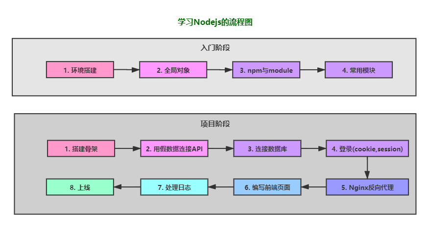
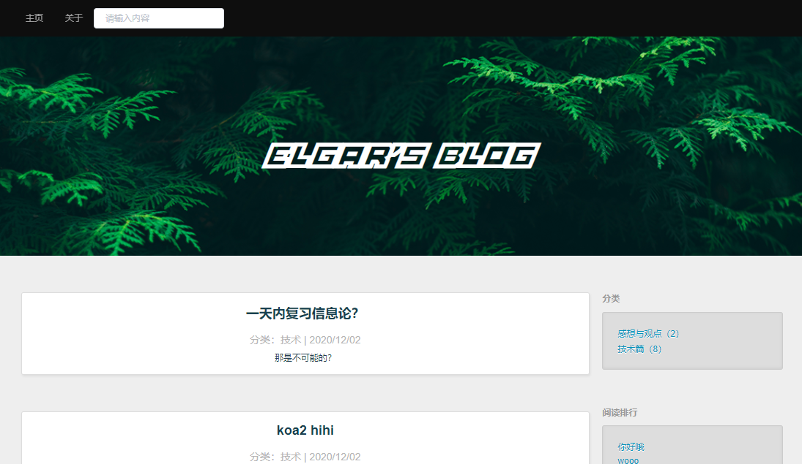

# 一起学习 Node.js

## 简介

这是一个 Node.js 的入门教程 + 实战教程。

从开始学习 Node.js 到上线部署项目。

## 目录

1. [Node.js 入门教程](./note/learn-node/README.md)
2. [不使用框架实现博客系统]()
3. [Express重写博客系统](./note/express/README.md)
4. [koa2重写博客系统](./note/koa2/1-start.md)
5. [前端页面用 vue ](./note/vue-blog/start.md)

项目的详细介绍下图所示。

| 博客页面 | 后台管理页面 |
|---|---|
|||

## 说明

本项目是我学习 Node.js 过程中的笔记，错误是难免的，如果有什么错误的地方欢迎纠正。

