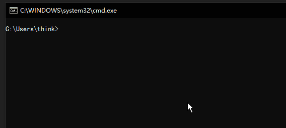

## 安装

### 1、Node是什么？

Node.js 是可以运行 JavaScript 语言环境。


### 2、有什么用？

Node.js 可以**读写文件**、可以发送**网络请求**、操作**数据库**、**摄像头**等等。

所以可以用于网页的后端，爬虫、桌面应用程序（Electron）。

举个例子 vscode 编辑器是用 Electron 写的。

### 3、运行第一个 Node 程序

使用之前我们需要安装 Node.js 运行的环境[下载](http://nodejs.cn/download/)

在 Windows 上安装时需要选择全部组件，**勾选** `Add to Path`。

 `Add to Path` 是配置环境变量。

需要检查以下是否安装成功，打开终端（windows下按住 `win` + `R` 输入 cmd  即可进入）输入：

```node
node -v
// 返回版本说明安装成功像这样 v12.11.1
```

如果报错，可能需要**配置环境**变量。



在 cmd 输入 `node` 即可进入 Node.js 运行环境，之后输入执行的程序，按下 `Enter` 即可运行。

```js
console.log('Hello NodeJS!')
// Hello NodeJS
```

这个相当于浏览器的控制台。


这样运行显然不行，我们需要运行 js 文件。

这里推荐 vscode 编辑器，怎么运行 js 文件呢？

```node 
// 创建 hello.js 文件 在里面写入
console.log('Hello NodeJS!')
```

保存后，在命令行打开此文件所在的目录，如果用 vscode 编辑器，右击`hello.js` 问价所在的文件夹点击 “在继承终端打开”, 进入中断后用以下命令运行：

```js
node .\hello.js
// 控制台会输出：Hello NodeJS!
```

{[(*hello*)]}

